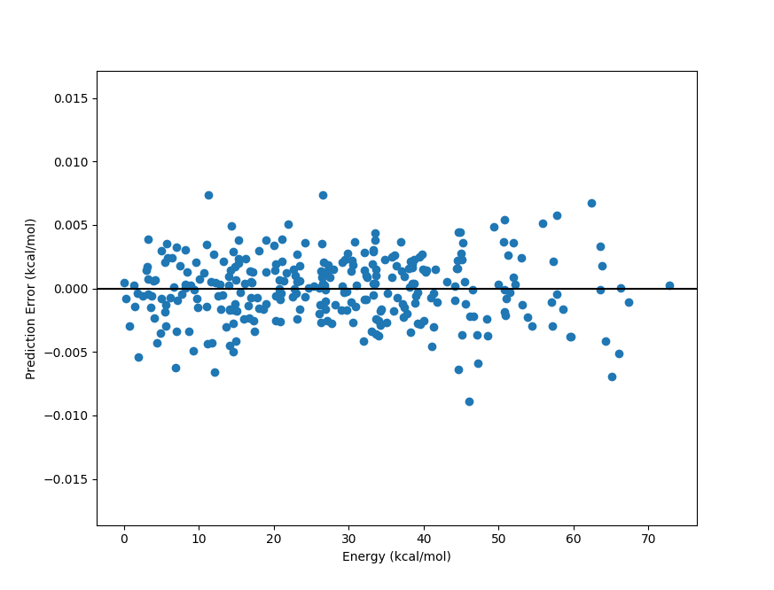

# PES-Learn Command-Line Interface Tutorial

PES-Learn is designed to work similarly to standard electronic structure theory packages: users can generate an input file with appropriate keywords, run the software, and get a result. This tutorial covers how to do exactly that.
Here we generate a machine-learning model of the PES of water from start to finish (no knowledge of Python required!).

## 1. Generating Data

### 1.1 Defining an internal coordinate grid
Currently PES-Learn supports generating points across PESs by displacing in simple internal coordinates (a 'Z-Matrix'). To do this, we must define a Z-Matrix in the input file. We first create an input file called `input.dat`:

```console
home:~$ vi input.dat
```

in the input file we define the Z-Matrix and the displacements:
```python
O
H 1 r1
H 1 r2 2 a1

r1 = [0.85, 1.30, 10]
r2 = [0.85, 1.30, 10]
a1 = [90.0, 120.0, 10] 
```

The syntax defining the internal coordinate ranges is of the form [start, stop, number of points], with the bounds included in the number of points. The angles and dihedrals are always specified in degrees. The units of length can be anything, though typically Angstrom or Bohr. Dummy atoms are supported (and in fact, are required if there are 3 or more co-linear atoms, otherwise in that case those internal coordinate configurations will just be deleted!). Labels for geometry parameters can be anything (RDUM, ROH1, A120, etc) as long as they do not start with a number. Parameters can be fixed with `r1 = 1.0`, etc. An equilibruim geometry can be specified in the order the internal coordinates appear with
```python
eq_geom = [0.96,0.96,104.5]
```
and this will also be included. 

### 1.2 Creating a Template file

Normally we would go on to build our input file by adding keywords controlling the program, but first let's talk about **template input files**. A template input file is a file named `template.dat` which is a **cartesian coordinate input file for an electronic structure theory package** such as Gaussian, Molpro, Psi4, CFOUR, QChem, NWChem, and so on. It does not matter what package you want to use, it only matters that the `template.dat` contains Cartesian coordinates, and computes an electronic energy by whatever means you wish. PES-Learn will use the template file to generate a bunch of (Guassian, Molpro, Psi4, etc) input files, each with different Cartesian geometries corresponding to the above internal coordinate grid. The template input file we will use in this example is a Psi4 input file which computes a CCSD(T)/cc-pvdz energy:
```python
molecule h2o {
0 1
H 0.00 0.00 0.00
H 0.00 0.00 0.00
O 0.00 0.00 0.00
}

set {
reference rhf
basis cc-pvdz
}
energy('ccsd(t)')
```

The actual contents of the Cartesian coordinates does not matter. Later on when we run the code, the auto-generated input files with Cartesian geometries corresponding to our internal coordinate grid will be put into their own newly-created sub-directories likes this:
```
PES_data/1/
PES_data/2/
PES_data/3/
...
```

This PES_data folder can then be zipped up and sent to whatever computing resources you want to use.

### 1.3 Data Generation Keywords

Let's go back to our PES-Learn input file, add a few keywords, and discuss them.
```python
O
H 1 r1
H 1 r2 2 a1

r1 = [0.85, 1.30, 10]
r2 = [0.85, 1.30, 10]
a1 = [90.0, 120.0, 10] 

# Data generation-relevant keywords
eq_geom = [0.96,0.96,104.5]
input_name = 'input.dat'
remove_redundancy = true
remember_redundancy = false
grid_reduction = 300
```
Comments (ignored text) can be specified with a `#` sign. All entries are case-insensitive. Multiple word phrases are seperated with an underscore. Text that doesn't match any keywords is simply ignored (in this way, the use of comment lines is really not necessary unless your are commenting out keyword options). **This means if you spell a keyword or its value incorrectly it will be ignored**. The first occurance of a keyword will be used.

* We discussed **`eq_geom`** before, it is a geometry forced into the dataset, and it would typically correspond to the global minimum at the level of theory you are using. It is often a good idea to create your dataset such that the minimum of the dataset is the true minimum of the surface, especially for vibrational levels applications. 
* **`input_name`** tells PES-Learn what to call the electronic structure theory input files. `'input.dat'` is the default value, no need to set it normally.  Note that it is surrounded in quotes; this is so PES-Learn doesn't touch it or change anything about it, such as lowering the case of all the letters. 

* **`remove_redundancy`** removes symmetry-redundant geometries from the internal coordinate grid. In this case, there is redundancy in the equivalent OH bonds and they will be removed. 

* **`remember_redundancy`** keeps a cache of redundant-geometry pairs, so that when the energies are parsed from the output files and the dataset is created later on, all of the original geometries are kept in the dataset, with duplicate energies for redundant geometries. If one does not use a permutation-invariant geometry for ML later, this may be useful.

* **`grid_reduction`** reduces the grid size to the value entered. In this case it means only 300 geometries will be created. This is done by finding the Euclidean distances between all the points in the dataset, and extracting a maximally spaced 'sub-grid' of the size specified. 

### 1.4 Running the code and generating the data

In the directory containing the PES-Learn input file `input.dat` and `template.dat`, simply run 
```console
home:~$ python path/to/PES-Learn/peslearn/driver.py
```
The code will then ask what you want to do, here we type `g` or `generate` and hit enter, and this is the output:
```
Do you want to 'generate' data, 'parse' data, or 'learn'?g

1000 internal coordinate displacements generated in 0.00741 seconds
Total displacements: 1001
Number of interatomic distances: 3
Geometry grid generated in 0.06 seconds
Removing symmetry-redundant geometries...  Redundancy removal took 0.01 seconds
Removed 450 redundant geometries from a set of 1001 geometries
Reducing size of configuration space from 551 datapoints to 300 datapoints
Configuration space reduction complete in 0.05 seconds
Your PES inputs are now generated. Run the jobs in the PES_data directory and then parse.
Data generation finished in 0.41 seconds
Total run time: 0.41 seconds
```

The 300 Psi4 input files with Cartesian coordinates corresponding to our internal coordinate grid are now placed into a directory called `PES_data`:
```
PES_data/1/
PES_data/2/
PES_data/3/
...
```

**Quick note:** you do not have to use the command line to specify whether you want to `generate`, `parse`, or `learn`, you can instead specify the `mode` keyword in the input file:
```python
mode = generate # or 'parse' or 'learn', or shorthand: 'g', 'p', 'l'
```
this is at times convenient if computations are submitted remotely in an automated fashion, and the users are not directly interacting with a command line.

We are now ready run the Psi4 energy computations.

## 2. Parsing Output files to collect electronic energies

Now that every Psi4 input file has been run, and there is a corresponding `output.dat` in each sub-directory of `PES_data`, we are ready to use PES-Learn to grab all of the energies, match them with the appropriate geometries, and create a dataset. 

There are two schemes for parsing output files with PES-Learn:
  * User-supplied Python regular expressions
  * cclib
  
**Regular expressions** are a pattern-matching syntax. Though they are somewhat tedious to use, they are completely general. Using the regular expression scheme requires
  1. Inspecting the electronic structure theory software output file
  2. Finding the line where the desired energy is 
  3. Writing a regular expression to match the line's text and grab the desired energy.
    
**cclib** is a Python library of hard-coded parsing routines. It works in a lot of cases. At the time of writing, cclib supports parsing `scfenergies`, ``mpenergies``, and `ccenergies`. These different modes attempt to find the highest level of theory SCF energy (Hartree-Fock or DFT), highest level of Moller-Plesset perturbation theory energy, or the highest level of theory coupled cluster energy. Since these are hard-coded routines that are version-dependent, there is no gurantee it will work! It is also a bit slower than regular expressions (i.e. milliseconds --> seconds slower)


### 2.1 Setting the appropriate parsing keywords in the PES-Learn input file

It is often a good idea to take a look at a successful output file in `PES_data/`. Here is the output file in `PES_data/1/`, which is the geometry corresponding to `eq_geom` defined earlier:

```
            **************************
            *                        *
            *        CCTRIPLES       *
            *                        *
            **************************


    Wave function   =    CCSD_T
    Reference wfn   =      RHF

    Nuclear Rep. energy (wfn)                =    9.168193296244223
    SCF energy          (wfn)                =  -76.026653661887252
    Reference energy    (file100)            =  -76.026653661887366
    CCSD energy         (file100)            =   -0.213480496782495
    Total CCSD energy   (file100)            =  -76.240134158669861

    Number of ijk index combinations:               35
    Memory available in words        :        65536000
    ~Words needed per explicit thread:            2048
    Number of threads for explicit ijk threading:    1

    MKL num_threads set to 1 for explicit threading.

    (T) energy                                =   -0.003068821713392
      * CCSD(T) total energy                  =  -76.243202980383259


    Psi4 stopped on: Thursday, 09 May 2019 01:51PM
    Psi4 wall time for execution: 0:00:01.05

*** Psi4 exiting successfully. Buy a developer a beer!
```

If we were to use cclib, we would put into our PES-Learn `input.dat` file:
```python
# Parsing-relevant keywords
energy = cclib
energy_cclib = ccenergies
```
to grab coupled cluster energies. **Unfortunately, at the time of writing, this only grabbed the CCSD energies and not the CCSD(T) energies (it's a good idea to always check**). Let's use regular expressions instead.

### 2.1.1 Regular expressions

One fact is always very important to keep in mind when using regular expressions in PES-Learn:  
**PES-Learn always grabs the last matching entry in the output file**  
This is good to know, since a pattern may match multiple entries in the output file, but it's okay as long as you want the *last one*.

We observe that the energy we want is always contained in a line like 
```
      * CCSD(T) total energy                  =  -76.243202980383259
```

So the general pattern we want to match is `total energy` (whitespace) `=` (whitespace) (negative floating point number). We may put into our PES-Learn input file the following regular expression:
```python
# Parsing-relevant keywords
energy = regex
energy_regex = 'total energy\s+=\s+(-\d+\.\d+)'
```

Here we have taken advantage of the fact that the pattern `total energy` does not appear anymore after the CCSD(T) energy in the output file. The above `energy_regex` line matches the words 'total energy' followed by one or more whitespaces `\s+`, an equal sign `=`, one or more whitespaces `\s+`, and then a negative floating point number `-\d+\.\d+` which we have necessarily enclosed in parentheses to indicate that we only want to capture the number itself, not the whole line. This is a bit cumbersome to use, so if this in foreign to you I recommend trying out various regular expressions via trial and error using Pythex https://pythex.org/ to ensure that the pattern is matched.

A few other valid `enegy_regex` lines would be
```python
energy_regex = 'CCSD\(T\) total energy\s+=\s+(-\d+\.\d+)'
```
```python
energy_regex = '=\s+(-\d+\.\d+)'
```
Note above that we had to "escape" the parentheses with backward slashes [since it is a reserved character.](https://www.debuggex.com/cheatsheet/regex/python)
If you want to be safe from parsing the wrong energy, more verbose is probably better.

### 2.2 Setting up the input file
Here we have added our parsing keywords to our PES-Learn input file. (We could have had these keywords defined earlier as well, but to keep things simple I am only adding them when needed.)
```python
O
H 1 r1
H 1 r2 2 a1

r1 = [0.85, 1.30, 10]
r2 = [0.85, 1.30, 10]
a1 = [90.0, 120.0, 10] 

# Data generation-relevant keywords
eq_geom = [0.96,0.96,104.5]
input_name = 'input.dat'
remove_redundancy = true
remember_redundancy = false
grid_reduction = 300

# Parsing-relevant keywords
energy = regex
energy_regex = 'total energy\s+=\s+(-\d+\.\d+)'
pes_name = 'PES.dat'
sort_pes = true           # sort in terms of increasing energy
pes_format = interatomics # could also choose internal coordinates r1, r2, a1
```

### 2.3 Parsing the output files and creating a dataset
Just as before, we run PES-Learn, and this time choose `parse` by typing `p` and hitting enter:
```console
home:~$ python path/to/PES-Learn/peslearn/driver.py
Do you want to 'generate' data, 'parse' data, or 'learn'?p
Parsed data has been written to PES.dat
Total run time: 0.38 seconds
```

The dataset `PES.dat` looks like this:
```python
r0,r1,r2,E
1.518123981600,0.960000000000,0.960000000000,-76.243202980383
1.455484441900,0.950000000000,0.950000000000,-76.242743191056
1.494132369500,1.000000000000,0.950000000000,-76.242037809799
1.568831329800,1.000000000000,1.000000000000,-76.241196021922
1.494050142500,1.000000000000,1.000000000000,-76.240995054410
```


## 3. Creating Auto-Generated Machine Learning Models of the Potential Energy Surface

### 3.1 Gaussian Process Regression

We now have in our working directory a file called `PES.dat`, created with the routine above. An auto-optimized machine learning model of the surface can be produced by this dataset. Below we have added keywords to our PES-Learn input file which are relevant to training a ML model


```python
O
H 1 r1
H 1 r2 2 a1

r1 = [0.85, 1.30, 10]
r2 = [0.85, 1.30, 10]
a1 = [90.0, 120.0, 10] 

# Data generation-relevant keywords
eq_geom = [0.96,0.96,104.5]
input_name = 'input.dat'
remove_redundancy = true
remember_redundancy = false
grid_reduction = 300

# Parsing-relevant keywords
energy = regex
energy_regex = 'total energy\s+=\s+(-\d+\.\d+)'
pes_name = 'PES.dat'
sort_pes = true           # sort in terms of increasing energy
pes_format = interatomics # could also choose internal coordinates r1, r2, a1

# ML-relevant keywords
ml_model = gp              # Use Gaussian Process regression
pes_format = interatomics  # Geometry values in the PES file
use_pips = true            # Transform interatomic distances into permutation invariant polynomials
hp_maxit = 15              # Train 15 models with hyperparameter optimization, select the best
training_points = 200      # Train with 200 points (out of 300 total)
sampling = structure_based # Sample training set by maximizing Euclidean distances
n_low_energy_train = 1     # Force lowest energy point into training set
```

We note that a **minimal working input file** would only need the internal coordinate definition (because we are using PIPs and need to know the atom types!) and the ML relevant keywords:

```python
O
H 1 r1
H 1 r2 2 a1

# ML-relevant keywords
ml_model = gp              # Use Gaussian Process regression
pes_format = interatomics  # Geometry values in the PES file
use_pips = true            # Transform interatomic distances into permutation invariant polynomials
hp_maxit = 15              # Train 15 models with hyperparameter optimization, select the best
training_points = 200      # Train with 200 points (out of 300 total)
sampling = structure_based # Sample training set by maximizing Euclidean distances
n_low_energy_train = 1     # Force lowest energy point into training set
```

running the following tries out several models and prints the performance statistics in units of wavenumbers (cm$^{-1}$):

<details>
  <summary>Click to expand and see all hyperparameter iterations</summary>
  
```console
home:~$ python path/to/PES-Learn/peslearn/driver.py
Do you want to 'generate' data, 'parse' data, or 'learn'?l
Using permutation invariant polynomial transformation for molecule type  A2B
Beginning hyperparameter optimization...
Trying 15 combinations of hyperparameters
Training with 200 points (Full dataset contains 300 points).
Using structure_based training set point sampling.
Errors are root-mean-square error in wavenumbers (cm-1)
Hyperparameters: 
{'morse_transform': {'morse': False}, 'pip': {'degree_reduction': False, 'pip': True}, 'scale_X': 'mm01', 'scale_y': None}
Test Dataset 5.38
Full Dataset 5.36
Median error: 4.18
Max 5 errors: [11.3 11.4 11.9 12.7 13.9]
Hyperparameters: 
{'morse_transform': {'morse': True, 'morse_alpha': 2.0}, 'pip': {'degree_reduction': True, 'pip': True}, 'scale_X': 'mm11', 'scale_y': 'mm11'}
Test Dataset 0.94
Full Dataset 0.77
Median error: 0.53
Max 5 errors: [1.9 2.  2.  2.  2.2]
Hyperparameters: 
{'morse_transform': {'morse': False}, 'pip': {'degree_reduction': True, 'pip': True}, 'scale_X': 'mm11', 'scale_y': 'mm11'}
Test Dataset 0.55
Full Dataset 0.51
Median error: 0.33
Max 5 errors: [1.2 1.3 1.3 1.5 1.8]
Hyperparameters: 
{'morse_transform': {'morse': False}, 'pip': {'degree_reduction': False, 'pip': True}, 'scale_X': 'mm01', 'scale_y': 'std'}
Test Dataset 0.52
Full Dataset 0.42
Median error: 0.26
Max 5 errors: [1.1 1.1 1.1 1.2 1.2]
Hyperparameters: 
{'morse_transform': {'morse': False}, 'pip': {'degree_reduction': False, 'pip': True}, 'scale_X': 'std', 'scale_y': None}
Test Dataset 5.38
Full Dataset 5.36
Median error: 4.17
Max 5 errors: [11.4 11.5 11.9 12.7 13.9]
Hyperparameters: 
{'morse_transform': {'morse': False}, 'pip': {'degree_reduction': True, 'pip': True}, 'scale_X': 'std', 'scale_y': 'mm01'}
Test Dataset 0.86
Full Dataset 0.81
Median error: 0.52
Max 5 errors: [2.  2.  2.2 2.3 3. ]
Hyperparameters: 
{'morse_transform': {'morse': False}, 'pip': {'degree_reduction': False, 'pip': True}, 'scale_X': 'mm11', 'scale_y': 'mm11'}
Test Dataset 0.54
Full Dataset 0.49
Median error: 0.35
Max 5 errors: [1.2 1.2 1.2 1.2 1.4]
Hyperparameters: 
{'morse_transform': {'morse': True, 'morse_alpha': 1.2000000000000002}, 'pip': {'degree_reduction': True, 'pip': True}, 'scale_X': 'mm01', 'scale_y': None}
Test Dataset 9.84
Full Dataset 8.51
Median error: 6.29
Max 5 errors: [19.4 20.4 20.5 21.1 25.2]
Hyperparameters: 
{'morse_transform': {'morse': True, 'morse_alpha': 1.8}, 'pip': {'degree_reduction': True, 'pip': True}, 'scale_X': None, 'scale_y': 'std'}
Test Dataset 0.28
Full Dataset 0.24
Median error: 0.15
Max 5 errors: [0.7 0.8 0.8 1.2 1.4]
Hyperparameters: 
{'morse_transform': {'morse': False}, 'pip': {'degree_reduction': False, 'pip': True}, 'scale_X': None, 'scale_y': 'mm01'}
Test Dataset 0.91
Full Dataset 0.87
Median error: 0.57
Max 5 errors: [2.2 2.2 2.3 2.4 2.8]
Hyperparameters: 
{'morse_transform': {'morse': False}, 'pip': {'degree_reduction': True, 'pip': True}, 'scale_X': None, 'scale_y': 'mm01'}
Test Dataset 0.97
Full Dataset 0.9
Median error: 0.61
Max 5 errors: [2.2 2.3 2.4 2.5 2.8]
Hyperparameters: 
{'morse_transform': {'morse': False}, 'pip': {'degree_reduction': False, 'pip': True}, 'scale_X': 'mm11', 'scale_y': None}
Test Dataset 5.38
Full Dataset 5.37
Median error: 4.15
Max 5 errors: [11.4 11.5 12.  12.7 13.9]
Hyperparameters: 
{'morse_transform': {'morse': True, 'morse_alpha': 1.3}, 'pip': {'degree_reduction': False, 'pip': True}, 'scale_X': 'mm01', 'scale_y': 'mm01'}
Test Dataset 1.37
Full Dataset 1.06
Median error: 0.57
Max 5 errors: [3.2 3.2 3.3 3.5 3.7]
Hyperparameters: 
{'morse_transform': {'morse': False}, 'pip': {'degree_reduction': True, 'pip': True}, 'scale_X': 'mm11', 'scale_y': None}
Test Dataset 5.7
Full Dataset 5.68
Median error: 4.33
Max 5 errors: [13.  13.8 14.7 14.7 15.1]
Hyperparameters: 
{'morse_transform': {'morse': True, 'morse_alpha': 1.5}, 'pip': {'degree_reduction': True, 'pip': True}, 'scale_X': 'mm01', 'scale_y': 'mm01'}
Test Dataset 1.3
Full Dataset 1.03
Median error: 0.65
Max 5 errors: [2.9 2.9 3.  3.  3.1]

###################################################
#                                                 #
#     Hyperparameter Optimization Complete!!!     #
#                                                 #
###################################################

Best performing hyperparameters are:
[('morse_transform', {'morse': True, 'morse_alpha': 1.8}), ('pip', {'degree_reduction': True, 'pip': True}), ('scale_X', None), ('scale_y', 'std')]
Fine-tuning final model architecture...
Hyperparameters:  {'morse_transform': {'morse': True, 'morse_alpha': 1.8}, 'pip': {'degree_reduction': True, 'pip': True}, 'scale_X': None, 'scale_y': 'std'}
Final model performance (cm-1):
Test Dataset 0.28  Full Dataset 0.24     Median error: 0.15  Max 5 errors: [0.7 0.8 0.8 1.2 1.4] 

Saving ML model data...
Total run time: 66.25 seconds
```
</details>

  
  
Training with just 200 points, the best model had a RMSE on the 100-point test set of 0.28 cm$^{-1}$, and the full 300 point dataset had a RMSE of 0.24 cm$^{-1}$. This is absurdly accurate; it's a good thing we used `grid_reduction` back when generating our data to reduce our dataset from 551 points to just 300! We clearly did not need more than a few hundred points to model this portion of the PES of water; any more computations would have been unnecessary! This is why it is important to probe how much data one needs along the surface at a **meaningful but low level of theory**. 

### 3.2 Using the GP model

After running the above, PES-Learn creates a directory `model1data` (subsequently trained models will not overwrite this, but instead create new directories `model2data`, `model3data`, etc.). Inside this directory is a variety of files which are self-explanatory.  

The most important file is the auto-generated Python script `compute_energy.py` which can be used to evaluate new energies using the model. It needs to be in the same directory as `PES.dat` and `model.json` to work. It contains a function `pes()` which takes one or more cartesian or internal coordinate arguments and outputs one or more energies corresponding to the geometries. If the argument `cartesian=False` is set, you must supply coordinates in the exact same format and exact same order as the model was trained on (i.e. the format in `PES.dat`). If the argument `cartesian=True` is set, cartesian coordinates are supplied in the same order as given in a typical PES_data input file (not the template.dat file). **Cartesians can only be supplied if the model was trained on interatomic distances or PIPs of the interatomic distances.**

The `compute_energy.py` file can be imported and used. Here's an example python script `use_model.py` which imports the `pes` function and evaluates some energies at some cartesian geometries.

```python
from compute_energy import pes

cart_geoms = [[0.0000000000, 0.0000000000, 1.1000000000, 0.0000000000, 0.7361215932, -0.4250000000, 0.0000000000, 0.0000000000, 0.0000000000],
              [0.0000000000, 0.2000000000, 1.2000000000, 0.0000000000, 0.7461215932, -0.4150000000, 0.0000000000, 0.0000000000, 0.1000000000],
              [0.0000000000, 0.1000000000, 1.3000000000, 0.0000000000, 0.7561215932, -0.4350000000, 0.0000000000, 0.0000000000, 0.2000000000]]

energies1 = pes(cart_geoms)
print(energies1)

interatomic_geoms = [[1.494050142500,1.000000000000,1.000000000000],
                     [1.597603916000,1.000000000000,0.950000000000],
                     [1.418793563200,1.000000000000,0.950000000000]]

energies2 = pes(interatomic_geoms, cartesian=False)
print(energies2)
```
The print statements yield the following output. The energy is in units of Hartrees (which are the unit of energy in our PES.dat which the model was trained on).

```
[[-76.20462724]
 [-76.21835841]
 [-76.21467994]]
[[-76.24099496]
 [-76.24031118]
 [-76.24024971]]
```


### 3.3 Neural Network Regression

Neural networks (NNs) are recommended for training sets of size 1000 and above for efficiency. This is because the hyperparameter tuning of NNs takes much longer than GPs, so there is an initial up-front cost to training NNs that GPs do not have. The NN building code can be broken down into three steps:
* Neural architecture search (NAS)
* Hyperparameter tuning
* Learning rate optimization

Early stopping is used more aggressively in the first steps than in the last. Therefore, the performance of models during the NAS and hyperparameter tuning steps should not be taken as final; the training of the models is being stopped early to save time. 

Batch learning with the L-BFGS optimizer is currently the only option. For high-level regression tasks, it is far superior to 1st order optimizers such as Adam, SGD, and RMSProp. 

The Neural Architecture Search (NAS) tries out several hidden layer structures. One can override default NAS hidden layer strucutres with the keyword `nas_trial_layers` with the syntax `nas_trial_layers = [[32], [32,32], [256]]`, which would try out NNs with a single hidden layer of 32 nodes, two hidden layers with 32 nodes, and a single hidden layer with 256 nodes. The default NAS space is very large, so if you observe on your first run with the default NAS space that your dataset does better with a large number of nodes ([256,256] for example) you may consider restricting the NAS space on future runs using the `nas_trial_layers` keyword. There should be at least 3 hidden layer structures in the NAS space.

Hyperparameter tuning is similar to the GP model optimizer. The learning rate optimizer is self-explanatory. There are checks in place to detect performance plateaus (in which learning rate decay triggers), or overfitting (in which case training is halted).

For neural networks, a validation set must be specified since they are more prone to overfitting. The validation points are sampled from all points which are not training set points. If one does not specify a number of validation points, by default half of the test set points are converted to validation set points. If you dataset has 1000 points and 800 are used for training, there would by default be 100 validation points and 100 test points. The validation error is used to optimize hyperparameters, while the test set error is not used for anything, though it is printed in all cases. 

A neural network can be trained with minimal modification of the GP input used previously: 

```python
O
H 1 r1
H 1 r2 2 a1

# ML-relevant keywords
ml_model = nn              # Use Neural Network regression
pes_format = interatomics  # Geometry values in the PES file
use_pips = true            # Transform interatomic distances into permutation invariant polynomials
hp_maxit = 15              # Train 15 models with hyperparameter optimization, select the best
training_points = 200      # Train with 200 points (out of 300 total)
validation_points = 50     # Validate with  50 points (50 left over for testing)
sampling = structure_based # Sample training set by maximizing Euclidean distances
n_low_energy_train = 1     # Force lowest energy point into training set
nas_trial_layers = [[32], [32,32], [64], [16,16,16]] # NAS hidden layer trial structures
```

The output of PES-Learn is: 

<details>
  <summary>Click to expand and see neural network optimization output</summary>
  
```console
home:~$ python path/to/PES-Learn/peslearn/driver.py
Do you want to 'generate' data, 'parse' data, or 'learn'?l
Do you want to 'generate' data, 'parse' data, or 'learn'?l
Using permutation invariant polynomial transformation for molecule type  A2B
Number of validation points not specified. Splitting test set in half --> 50% test, 50% validation
Training with 200 points. Validating with 50 points. Full dataset contains 300 points.
Using structure_based training set point sampling.
Errors are root-mean-square error in wavenumbers (cm-1)

Performing neural architecture search...

Hidden layer structure:  [32]
Hyperparameters:  {'morse_transform': {'morse': False}, 'scale_X': {'scale_X': 'std', 'activation': 'tanh'}, 'scale_y': 'std', 'pip': {'degree_reduction': False, 'pip': True}, 'layers': [32]}
Test set RMSE (cm-1):  5.11  Validation set RMSE (cm-1):  5.03 Full dataset RMSE (cm-1):  4.40
Hidden layer structure:  [64]
Hyperparameters:  {'morse_transform': {'morse': False}, 'scale_X': {'scale_X': 'std', 'activation': 'tanh'}, 'scale_y': 'std', 'pip': {'degree_reduction': False, 'pip': True}, 'layers': [64]}
Test set RMSE (cm-1):  6.30  Validation set RMSE (cm-1):  4.59 Full dataset RMSE (cm-1):  5.06
Hidden layer structure:  [16, 16, 16]
Hyperparameters:  {'morse_transform': {'morse': False}, 'scale_X': {'scale_X': 'std', 'activation': 'tanh'}, 'scale_y': 'std', 'pip': {'degree_reduction': False, 'pip': True}, 'layers': [16, 16, 16]}
Test set RMSE (cm-1):  5.83  Validation set RMSE (cm-1):  6.52 Full dataset RMSE (cm-1):  4.99
Hidden layer structure:  [32, 32]
Hyperparameters:  {'morse_transform': {'morse': False}, 'scale_X': {'scale_X': 'std', 'activation': 'tanh'}, 'scale_y': 'std', 'pip': {'degree_reduction': False, 'pip': True}, 'layers': [32, 32]}
Test set RMSE (cm-1):  1.67  Validation set RMSE (cm-1):  1.69 Full dataset RMSE (cm-1):  1.57

Neural architecture search complete. Best hidden layer structures: [[32, 32], [32], [16, 16, 16]]

Beginning hyperparameter optimization...
Trying 15 combinations of hyperparameters
Hyperparameters: 
{'layers': (32,), 'morse_transform': {'morse': True, 'morse_alpha': 1.6}, 'pip': {'degree_reduction': False, 'pip': True}, 'scale_X': {'activation': 'tanh', 'scale_X': 'std'}, 'scale_y': 'mm11'}
Test set RMSE (cm-1):  2.98  Validation set RMSE (cm-1):  2.67 Full dataset RMSE (cm-1):  2.94
Hyperparameters: 
{'layers': (32,), 'morse_transform': {'morse': False}, 'pip': {'degree_reduction': False, 'pip': True}, 'scale_X': {'activation': 'tanh', 'scale_X': 'mm11'}, 'scale_y': 'mm01'}
Test set RMSE (cm-1): 17.35  Validation set RMSE (cm-1): 16.15 Full dataset RMSE (cm-1): 17.24
Hyperparameters: 
{'layers': (32, 32), 'morse_transform': {'morse': True, 'morse_alpha': 1.6}, 'pip': {'degree_reduction': False, 'pip': True}, 'scale_X': {'activation': 'tanh', 'scale_X': 'mm11'}, 'scale_y': 'mm01'}
Test set RMSE (cm-1):   inf  Validation set RMSE (cm-1):   inf Full dataset RMSE (cm-1):   inf
Hyperparameters: 
{'layers': (16, 16, 16), 'morse_transform': {'morse': True, 'morse_alpha': 1.9000000000000001}, 'pip': {'degree_reduction': True, 'pip': True}, 'scale_X': {'activation': 'tanh', 'scale_X': 'std'}, 'scale_y': 'std'}
Test set RMSE (cm-1):  4.13  Validation set RMSE (cm-1):  4.00 Full dataset RMSE (cm-1):  3.65
Hyperparameters: 
{'layers': (32,), 'morse_transform': {'morse': False}, 'pip': {'degree_reduction': True, 'pip': True}, 'scale_X': {'activation': 'tanh', 'scale_X': 'mm11'}, 'scale_y': 'std'}
Test set RMSE (cm-1):  1.49  Validation set RMSE (cm-1):  1.42 Full dataset RMSE (cm-1):  1.31
Hyperparameters: 
{'layers': (32, 32), 'morse_transform': {'morse': True, 'morse_alpha': 1.6}, 'pip': {'degree_reduction': False, 'pip': True}, 'scale_X': {'activation': 'tanh', 'scale_X': 'mm11'}, 'scale_y': 'std'}
Test set RMSE (cm-1):   inf  Validation set RMSE (cm-1):   inf Full dataset RMSE (cm-1):   inf
Hyperparameters: 
{'layers': (32,), 'morse_transform': {'morse': False}, 'pip': {'degree_reduction': False, 'pip': True}, 'scale_X': {'activation': 'tanh', 'scale_X': 'std'}, 'scale_y': 'mm11'}
Test set RMSE (cm-1): 25623.45  Validation set RMSE (cm-1): 44170.74 Full dataset RMSE (cm-1): 20903.16
Hyperparameters: 
{'layers': (16, 16, 16), 'morse_transform': {'morse': False}, 'pip': {'degree_reduction': True, 'pip': True}, 'scale_X': {'activation': 'tanh', 'scale_X': 'std'}, 'scale_y': 'mm11'}
Test set RMSE (cm-1):  4.87  Validation set RMSE (cm-1):  3.20 Full dataset RMSE (cm-1):  3.10
Hyperparameters: 
{'layers': (32, 32), 'morse_transform': {'morse': False}, 'pip': {'degree_reduction': True, 'pip': True}, 'scale_X': {'activation': 'tanh', 'scale_X': 'std'}, 'scale_y': 'std'}
Test set RMSE (cm-1):  0.81  Validation set RMSE (cm-1):  0.82 Full dataset RMSE (cm-1):  0.71
Hyperparameters: 
{'layers': (16, 16, 16), 'morse_transform': {'morse': False}, 'pip': {'degree_reduction': True, 'pip': True}, 'scale_X': {'activation': 'tanh', 'scale_X': 'mm11'}, 'scale_y': 'std'}
Test set RMSE (cm-1):  2.61  Validation set RMSE (cm-1):  2.43 Full dataset RMSE (cm-1):  2.11
Hyperparameters: 
{'layers': (32, 32), 'morse_transform': {'morse': True, 'morse_alpha': 1.5}, 'pip': {'degree_reduction': False, 'pip': True}, 'scale_X': {'activation': 'tanh', 'scale_X': 'mm11'}, 'scale_y': 'std'}
Test set RMSE (cm-1):  4.09  Validation set RMSE (cm-1):  3.02 Full dataset RMSE (cm-1):  3.41
Hyperparameters: 
{'layers': (32,), 'morse_transform': {'morse': True, 'morse_alpha': 1.8}, 'pip': {'degree_reduction': True, 'pip': True}, 'scale_X': {'activation': 'tanh', 'scale_X': 'mm11'}, 'scale_y': 'mm11'}
Test set RMSE (cm-1):  1.99  Validation set RMSE (cm-1):  1.93 Full dataset RMSE (cm-1):  2.23
Hyperparameters: 
{'layers': (16, 16, 16), 'morse_transform': {'morse': False}, 'pip': {'degree_reduction': False, 'pip': True}, 'scale_X': {'activation': 'tanh', 'scale_X': 'std'}, 'scale_y': 'mm01'}
Test set RMSE (cm-1):   inf  Validation set RMSE (cm-1):   inf Full dataset RMSE (cm-1):   inf
Hyperparameters: 
{'layers': (16, 16, 16), 'morse_transform': {'morse': False}, 'pip': {'degree_reduction': False, 'pip': True}, 'scale_X': {'activation': 'tanh', 'scale_X': 'std'}, 'scale_y': 'std'}
Test set RMSE (cm-1):  5.83  Validation set RMSE (cm-1):  6.52 Full dataset RMSE (cm-1):  4.99
Hyperparameters: 
{'layers': (16, 16, 16), 'morse_transform': {'morse': True, 'morse_alpha': 1.6}, 'pip': {'degree_reduction': True, 'pip': True}, 'scale_X': {'activation': 'tanh', 'scale_X': 'std'}, 'scale_y': 'mm11'}
Test set RMSE (cm-1):  2.82  Validation set RMSE (cm-1):  2.70 Full dataset RMSE (cm-1):  2.61

###################################################
#                                                 #
#     Hyperparameter Optimization Complete!!!     #
#                                                 #
###################################################

Best performing hyperparameters are:
[('layers', (32, 32)), ('morse_transform', {'morse': False}), ('pip', {'degree_reduction': True, 'pip': True}), ('scale_X', {'activation': 'tanh', 'scale_X': 'std'}), ('scale_y', 'std')]
Optimizing learning rate...
Hyperparameters:  {'layers': (32, 32), 'morse_transform': {'morse': False}, 'pip': {'degree_reduction': True, 'pip': True}, 'scale_X': {'activation': 'tanh', 'scale_X': 'std'}, 'scale_y': 'std', 'lr': 1.0}
Test set RMSE (cm-1): 316275944698408704.00  Validation set RMSE (cm-1): 278706602952744288.00 Full dataset RMSE (cm-1): 269540779801922272.00
Hyperparameters:  {'layers': (32, 32), 'morse_transform': {'morse': False}, 'pip': {'degree_reduction': True, 'pip': True}, 'scale_X': {'activation': 'tanh', 'scale_X': 'std'}, 'scale_y': 'std', 'lr': 0.8}
Test set RMSE (cm-1):  5.71  Validation set RMSE (cm-1):  4.43 Full dataset RMSE (cm-1):  3.70
Hyperparameters:  {'layers': (32, 32), 'morse_transform': {'morse': False}, 'pip': {'degree_reduction': True, 'pip': True}, 'scale_X': {'activation': 'tanh', 'scale_X': 'std'}, 'scale_y': 'std', 'lr': 0.6}
Test set RMSE (cm-1): 42.92  Validation set RMSE (cm-1): 27.75 Full dataset RMSE (cm-1): 21.25
Hyperparameters:  {'layers': (32, 32), 'morse_transform': {'morse': False}, 'pip': {'degree_reduction': True, 'pip': True}, 'scale_X': {'activation': 'tanh', 'scale_X': 'std'}, 'scale_y': 'std', 'lr': 0.5}
Test set RMSE (cm-1):  0.81  Validation set RMSE (cm-1):  0.82 Full dataset RMSE (cm-1):  0.71
Hyperparameters:  {'layers': (32, 32), 'morse_transform': {'morse': False}, 'pip': {'degree_reduction': True, 'pip': True}, 'scale_X': {'activation': 'tanh', 'scale_X': 'std'}, 'scale_y': 'std', 'lr': 0.4}
Test set RMSE (cm-1):  1.30  Validation set RMSE (cm-1):  0.98 Full dataset RMSE (cm-1):  1.06
Hyperparameters:  {'layers': (32, 32), 'morse_transform': {'morse': False}, 'pip': {'degree_reduction': True, 'pip': True}, 'scale_X': {'activation': 'tanh', 'scale_X': 'std'}, 'scale_y': 'std', 'lr': 0.2}
Test set RMSE (cm-1):  1.50  Validation set RMSE (cm-1):  1.12 Full dataset RMSE (cm-1):  1.19
Fine-tuning final model...
Hyperparameters:  {'layers': (32, 32), 'morse_transform': {'morse': False}, 'pip': {'degree_reduction': True, 'pip': True}, 'scale_X': {'activation': 'tanh', 'scale_X': 'std'}, 'scale_y': 'std', 'lr': 0.5}
Epoch 1 Validation RMSE (cm-1): 2008.26
Epoch 2 Validation RMSE (cm-1): 719.83
Epoch 3 Validation RMSE (cm-1): 411.05
Epoch 4 Validation RMSE (cm-1): 221.48
Epoch 5 Validation RMSE (cm-1): 173.03
Epoch 6 Validation RMSE (cm-1): 149.78
Epoch 7 Validation RMSE (cm-1): 135.74
Epoch 8 Validation RMSE (cm-1): 116.26
Epoch 9 Validation RMSE (cm-1): 93.12
Epoch 10 Validation RMSE (cm-1): 84.77
Epoch 11 Validation RMSE (cm-1): 76.86
Epoch 12 Validation RMSE (cm-1): 72.43
Epoch 13 Validation RMSE (cm-1): 67.05
Epoch 14 Validation RMSE (cm-1): 67.59
Epoch 15 Validation RMSE (cm-1): 56.94
Epoch 16 Validation RMSE (cm-1): 52.21
Epoch 17 Validation RMSE (cm-1): 50.24
Epoch 18 Validation RMSE (cm-1): 43.04
Epoch 19 Validation RMSE (cm-1): 40.72
Epoch 20 Validation RMSE (cm-1): 40.88
Epoch 21 Validation RMSE (cm-1): 38.65
Epoch 22 Validation RMSE (cm-1): 37.24
Epoch 23 Validation RMSE (cm-1): 35.34
Epoch 24 Validation RMSE (cm-1): 33.33
Epoch 25 Validation RMSE (cm-1): 31.03
Epoch 26 Validation RMSE (cm-1): 29.64
Epoch 27 Validation RMSE (cm-1): 28.02
Epoch 28 Validation RMSE (cm-1): 28.82
Epoch 29 Validation RMSE (cm-1): 28.59
Epoch 30 Validation RMSE (cm-1): 30.28
Epoch 31 Validation RMSE (cm-1): 27.81
Epoch 32 Validation RMSE (cm-1): 28.24
Epoch 33 Validation RMSE (cm-1): 28.89
Epoch 34 Validation RMSE (cm-1): 27.64
Epoch 35 Validation RMSE (cm-1): 25.40
Epoch 36 Validation RMSE (cm-1): 23.92
Epoch 37 Validation RMSE (cm-1): 21.53
Epoch 38 Validation RMSE (cm-1): 21.10
Epoch 39 Validation RMSE (cm-1): 20.71
Epoch 40 Validation RMSE (cm-1): 20.27
Epoch 41 Validation RMSE (cm-1): 19.77
Epoch 42 Validation RMSE (cm-1): 19.11
Epoch 43 Validation RMSE (cm-1): 18.45
Epoch 44 Validation RMSE (cm-1): 17.98
Epoch 45 Validation RMSE (cm-1): 17.42
Epoch 46 Validation RMSE (cm-1): 17.33
Epoch 47 Validation RMSE (cm-1): 16.71
Epoch 48 Validation RMSE (cm-1): 15.71
Epoch 49 Validation RMSE (cm-1): 14.87
Epoch 50 Validation RMSE (cm-1): 13.95
Epoch 51 Validation RMSE (cm-1): 13.34
Epoch 52 Validation RMSE (cm-1): 13.34
Epoch 53 Validation RMSE (cm-1): 12.74
Epoch 54 Validation RMSE (cm-1): 12.85
Epoch 55 Validation RMSE (cm-1): 12.85
Epoch 56 Validation RMSE (cm-1): 13.28
Epoch 57 Validation RMSE (cm-1): 13.33
Epoch 58 Validation RMSE (cm-1): 12.97
Epoch 59 Validation RMSE (cm-1): 11.80
Epoch 60 Validation RMSE (cm-1): 11.24
Epoch 61 Validation RMSE (cm-1): 10.88
Epoch 62 Validation RMSE (cm-1): 10.15
Epoch 63 Validation RMSE (cm-1):  9.99
Epoch 64 Validation RMSE (cm-1):  9.91
Epoch 65 Validation RMSE (cm-1):  9.44
Epoch 66 Validation RMSE (cm-1):  9.23
Epoch 67 Validation RMSE (cm-1):  9.08
Epoch 68 Validation RMSE (cm-1):  8.83
Epoch 69 Validation RMSE (cm-1):  8.84
Epoch 70 Validation RMSE (cm-1):  8.66
Epoch 71 Validation RMSE (cm-1):  8.35
Epoch 72 Validation RMSE (cm-1):  8.19
Epoch 73 Validation RMSE (cm-1):  8.15
Epoch 74 Validation RMSE (cm-1):  7.91
Epoch 75 Validation RMSE (cm-1):  7.93
Epoch 76 Validation RMSE (cm-1):  7.68
Epoch 77 Validation RMSE (cm-1):  7.59
Epoch 78 Validation RMSE (cm-1):  7.66
Epoch 79 Validation RMSE (cm-1):  7.27
Epoch 80 Validation RMSE (cm-1):  7.03
Epoch 81 Validation RMSE (cm-1):  6.82
Epoch 82 Validation RMSE (cm-1):  6.95
Epoch 83 Validation RMSE (cm-1):  6.64
Epoch 84 Validation RMSE (cm-1):  6.51
Epoch 85 Validation RMSE (cm-1):  6.41
Epoch 86 Validation RMSE (cm-1):  6.49
Epoch 87 Validation RMSE (cm-1):  6.64
Epoch 88 Validation RMSE (cm-1):  6.73
Epoch 89 Validation RMSE (cm-1):  6.77
Epoch 90 Validation RMSE (cm-1):  6.72
Epoch 91 Validation RMSE (cm-1):  6.71
Epoch 92 Validation RMSE (cm-1):  6.43
Epoch 93 Validation RMSE (cm-1):  6.25
Epoch 94 Validation RMSE (cm-1):  6.23
Epoch 95 Validation RMSE (cm-1):  6.18
Epoch 96 Validation RMSE (cm-1):  6.14
Epoch 97 Validation RMSE (cm-1):  6.06
Epoch 98 Validation RMSE (cm-1):  5.73
Epoch 99 Validation RMSE (cm-1):  5.54
Epoch 100 Validation RMSE (cm-1):  5.10
Epoch 101 Validation RMSE (cm-1):  4.82
Epoch 102 Validation RMSE (cm-1):  4.75
Epoch 103 Validation RMSE (cm-1):  4.74
Epoch 104 Validation RMSE (cm-1):  4.66
Epoch 105 Validation RMSE (cm-1):  4.68
Epoch 106 Validation RMSE (cm-1):  4.58
Epoch 107 Validation RMSE (cm-1):  4.60
Epoch 108 Validation RMSE (cm-1):  4.56
Epoch 109 Validation RMSE (cm-1):  4.48
Epoch 110 Validation RMSE (cm-1):  4.36
Epoch 111 Validation RMSE (cm-1):  4.37
Epoch 112 Validation RMSE (cm-1):  4.31
Epoch 113 Validation RMSE (cm-1):  4.22
Epoch 114 Validation RMSE (cm-1):  4.22
Epoch 115 Validation RMSE (cm-1):  4.23
Epoch 116 Validation RMSE (cm-1):  4.19
Epoch 117 Validation RMSE (cm-1):  4.25
Epoch 118 Validation RMSE (cm-1):  4.01
Epoch 119 Validation RMSE (cm-1):  3.89
Epoch 120 Validation RMSE (cm-1):  3.83
Epoch 121 Validation RMSE (cm-1):  3.90
Epoch 122 Validation RMSE (cm-1):  3.89
Epoch 123 Validation RMSE (cm-1):  3.87
Epoch 124 Validation RMSE (cm-1):  3.90
Epoch 125 Validation RMSE (cm-1):  3.96
Epoch 126 Validation RMSE (cm-1):  3.91
Epoch 127 Validation RMSE (cm-1):  3.89
Epoch 128 Validation RMSE (cm-1):  3.98
Epoch 129 Validation RMSE (cm-1):  4.01
Epoch 130 Validation RMSE (cm-1):  3.93
Epoch 131 Validation RMSE (cm-1):  3.77
Epoch 132 Validation RMSE (cm-1):  3.59
Epoch 133 Validation RMSE (cm-1):  3.33
Epoch 134 Validation RMSE (cm-1):  3.22
Epoch 135 Validation RMSE (cm-1):  3.26
Epoch 136 Validation RMSE (cm-1):  3.26
Epoch 137 Validation RMSE (cm-1):  3.26
Epoch 138 Validation RMSE (cm-1):  3.30
Epoch 139 Validation RMSE (cm-1):  3.23
Epoch 140 Validation RMSE (cm-1):  3.13
Epoch 141 Validation RMSE (cm-1):  3.23
Epoch 142 Validation RMSE (cm-1):  3.23
Epoch 143 Validation RMSE (cm-1):  3.22
Epoch 144 Validation RMSE (cm-1):  3.25
Epoch 145 Validation RMSE (cm-1):  3.26
Epoch 146 Validation RMSE (cm-1):  3.09
Epoch 147 Validation RMSE (cm-1):  3.02
Epoch 148 Validation RMSE (cm-1):  3.01
Epoch 149 Validation RMSE (cm-1):  3.04
Epoch 150 Validation RMSE (cm-1):  2.96
Epoch 151 Validation RMSE (cm-1):  2.92
Epoch 152 Validation RMSE (cm-1):  2.88
Epoch 153 Validation RMSE (cm-1):  2.87
Epoch 154 Validation RMSE (cm-1):  2.83
Epoch 155 Validation RMSE (cm-1):  2.91
Epoch 156 Validation RMSE (cm-1):  2.86
Epoch 157 Validation RMSE (cm-1):  2.88
Epoch 158 Validation RMSE (cm-1):  2.78
Epoch 159 Validation RMSE (cm-1):  2.72
Epoch 160 Validation RMSE (cm-1):  2.78
Epoch 161 Validation RMSE (cm-1):  2.78
Epoch 162 Validation RMSE (cm-1):  2.77
Epoch 163 Validation RMSE (cm-1):  2.82
Epoch 164 Validation RMSE (cm-1):  2.82
Epoch 165 Validation RMSE (cm-1):  2.82
Epoch 166 Validation RMSE (cm-1):  2.76
Epoch 167 Validation RMSE (cm-1):  2.75
Epoch 168 Validation RMSE (cm-1):  2.77
Epoch 169 Validation RMSE (cm-1):  2.75
Epoch 170 Validation RMSE (cm-1):  2.75
Epoch 171 Validation RMSE (cm-1):  2.79
Epoch 172 Validation RMSE (cm-1):  2.80
Epoch 173 Validation RMSE (cm-1):  2.71
Epoch 174 Validation RMSE (cm-1):  2.71
Epoch 175 Validation RMSE (cm-1):  2.71
Epoch 176 Validation RMSE (cm-1):  2.70
Epoch 177 Validation RMSE (cm-1):  2.70
Epoch 178 Validation RMSE (cm-1):  2.68
Epoch 179 Validation RMSE (cm-1):  2.68
Epoch 180 Validation RMSE (cm-1):  2.65
Epoch 181 Validation RMSE (cm-1):  2.64
Epoch 182 Validation RMSE (cm-1):  2.63
Epoch 183 Validation RMSE (cm-1):  2.60
Epoch 184 Validation RMSE (cm-1):  2.56
Epoch 185 Validation RMSE (cm-1):  2.58
Epoch 186 Validation RMSE (cm-1):  2.57
Epoch 187 Validation RMSE (cm-1):  2.55
Epoch 188 Validation RMSE (cm-1):  2.53
Epoch 189 Validation RMSE (cm-1):  2.52
Epoch 190 Validation RMSE (cm-1):  2.51
Epoch 191 Validation RMSE (cm-1):  2.44
Epoch 192 Validation RMSE (cm-1):  2.34
Epoch 193 Validation RMSE (cm-1):  2.29
Epoch 194 Validation RMSE (cm-1):  2.24
Epoch 195 Validation RMSE (cm-1):  2.20
Epoch 196 Validation RMSE (cm-1):  2.24
Epoch 197 Validation RMSE (cm-1):  2.24
Epoch 198 Validation RMSE (cm-1):  2.25
Epoch 199 Validation RMSE (cm-1):  2.25
Epoch 200 Validation RMSE (cm-1):  2.23
Epoch 201 Validation RMSE (cm-1):  2.25
Epoch 202 Validation RMSE (cm-1):  2.25
Epoch 203 Validation RMSE (cm-1):  2.25
Epoch 204 Validation RMSE (cm-1):  2.24
Epoch 205 Validation RMSE (cm-1):  2.25
Epoch 206 Validation RMSE (cm-1):  2.25
Epoch 207 Validation RMSE (cm-1):  2.23
Epoch 208 Validation RMSE (cm-1):  2.17
Epoch 209 Validation RMSE (cm-1):  2.11
Epoch 210 Validation RMSE (cm-1):  2.11
Epoch 211 Validation RMSE (cm-1):  2.06
Epoch 212 Validation RMSE (cm-1):  2.04
Epoch 213 Validation RMSE (cm-1):  2.00
Epoch 214 Validation RMSE (cm-1):  1.91
Epoch 215 Validation RMSE (cm-1):  1.85
Epoch 216 Validation RMSE (cm-1):  1.87
Epoch 217 Validation RMSE (cm-1):  1.83
Epoch 218 Validation RMSE (cm-1):  1.82
Epoch 219 Validation RMSE (cm-1):  1.82
Epoch 220 Validation RMSE (cm-1):  1.81
Epoch 221 Validation RMSE (cm-1):  1.81
Epoch 222 Validation RMSE (cm-1):  1.80
Epoch 223 Validation RMSE (cm-1):  1.82
Epoch 224 Validation RMSE (cm-1):  1.77
Epoch 225 Validation RMSE (cm-1):  1.76
Epoch 226 Validation RMSE (cm-1):  1.72
Epoch 227 Validation RMSE (cm-1):  1.67
Epoch 228 Validation RMSE (cm-1):  1.61
Epoch 229 Validation RMSE (cm-1):  1.53
Epoch 230 Validation RMSE (cm-1):  1.57
Epoch 231 Validation RMSE (cm-1):  1.60
Epoch 232 Validation RMSE (cm-1):  1.61
Epoch 233 Validation RMSE (cm-1):  1.63
Epoch 234 Validation RMSE (cm-1):  1.62
Epoch 235 Validation RMSE (cm-1):  1.58
Epoch 236 Validation RMSE (cm-1):  1.53
Epoch 237 Validation RMSE (cm-1):  1.53
Epoch 238 Validation RMSE (cm-1):  1.52
Epoch 239 Validation RMSE (cm-1):  1.52
Epoch 240 Validation RMSE (cm-1):  1.53
Epoch 241 Validation RMSE (cm-1):  1.52
Epoch 242 Validation RMSE (cm-1):  1.52
Epoch 243 Validation RMSE (cm-1):  1.52
Epoch 244 Validation RMSE (cm-1):  1.53
Epoch 245 Validation RMSE (cm-1):  1.53
Epoch 246 Validation RMSE (cm-1):  1.53
Epoch 247 Validation RMSE (cm-1):  1.53
Epoch 248 Validation RMSE (cm-1):  1.52
Epoch 249 Validation RMSE (cm-1):  1.51
Epoch 250 Validation RMSE (cm-1):  1.51
Epoch 251 Validation RMSE (cm-1):  1.51
Epoch 252 Validation RMSE (cm-1):  1.51
Epoch 253 Validation RMSE (cm-1):  1.51
Epoch 254 Validation RMSE (cm-1):  1.51
Epoch 255 Validation RMSE (cm-1):  1.51
Epoch 256 Validation RMSE (cm-1):  1.50
Epoch 257 Validation RMSE (cm-1):  1.49
Epoch 258 Validation RMSE (cm-1):  1.46
Epoch 259 Validation RMSE (cm-1):  1.50
Epoch 260 Validation RMSE (cm-1):  1.46
Epoch 261 Validation RMSE (cm-1):  1.45
Epoch 262 Validation RMSE (cm-1):  1.43
Epoch 263 Validation RMSE (cm-1):  1.44
Epoch 264 Validation RMSE (cm-1):  1.45
Epoch 265 Validation RMSE (cm-1):  1.46
Epoch 266 Validation RMSE (cm-1):  1.46
Epoch 267 Validation RMSE (cm-1):  1.46
Epoch 268 Validation RMSE (cm-1):  1.45
Epoch 269 Validation RMSE (cm-1):  1.44
Epoch 270 Validation RMSE (cm-1):  1.42
Epoch 271 Validation RMSE (cm-1):  1.43
Epoch 272 Validation RMSE (cm-1):  1.41
Epoch 273 Validation RMSE (cm-1):  1.37
Epoch 274 Validation RMSE (cm-1):  1.35
Epoch 275 Validation RMSE (cm-1):  1.30
Epoch 276 Validation RMSE (cm-1):  1.30
Epoch 277 Validation RMSE (cm-1):  1.31
Epoch 278 Validation RMSE (cm-1):  1.32
Epoch 279 Validation RMSE (cm-1):  1.28
Epoch 280 Validation RMSE (cm-1):  1.30
Epoch 281 Validation RMSE (cm-1):  1.30
Epoch 282 Validation RMSE (cm-1):  1.29
Epoch 283 Validation RMSE (cm-1):  1.28
Epoch 284 Validation RMSE (cm-1):  1.28
Epoch 285 Validation RMSE (cm-1):  1.28
Epoch 286 Validation RMSE (cm-1):  1.28
Epoch 287 Validation RMSE (cm-1):  1.28
Epoch 288 Validation RMSE (cm-1):  1.29
Epoch 289 Validation RMSE (cm-1):  1.28
Epoch 290 Validation RMSE (cm-1):  1.28
Epoch 291 Validation RMSE (cm-1):  1.28
Epoch 292 Validation RMSE (cm-1):  1.29
Epoch 293 Validation RMSE (cm-1):  1.27
Epoch 294 Validation RMSE (cm-1):  1.26
Epoch 295 Validation RMSE (cm-1):  1.26
Epoch 296 Validation RMSE (cm-1):  1.26
Epoch 297 Validation RMSE (cm-1):  1.25
Epoch 298 Validation RMSE (cm-1):  1.25
Epoch 299 Validation RMSE (cm-1):  1.26
Epoch 300 Validation RMSE (cm-1):  1.26
Epoch 301 Validation RMSE (cm-1):  1.27
Epoch 302 Validation RMSE (cm-1):  1.27
Epoch 303 Validation RMSE (cm-1):  1.24
Epoch 304 Validation RMSE (cm-1):  1.21
Epoch 305 Validation RMSE (cm-1):  1.17
Epoch 306 Validation RMSE (cm-1):  1.21
Epoch 307 Validation RMSE (cm-1):  1.21
Epoch 308 Validation RMSE (cm-1):  1.19
Epoch 309 Validation RMSE (cm-1):  1.19
Epoch 310 Validation RMSE (cm-1):  1.21
Epoch 311 Validation RMSE (cm-1):  1.20
Epoch 312 Validation RMSE (cm-1):  1.19
Epoch 313 Validation RMSE (cm-1):  1.18
Epoch 314 Validation RMSE (cm-1):  1.18
Epoch 315 Validation RMSE (cm-1):  1.16
Epoch 316 Validation RMSE (cm-1):  1.14
Epoch 317 Validation RMSE (cm-1):  1.12
Epoch 318 Validation RMSE (cm-1):  1.11
Epoch 319 Validation RMSE (cm-1):  1.10
Epoch 320 Validation RMSE (cm-1):  1.10
Epoch 321 Validation RMSE (cm-1):  1.10
Epoch 322 Validation RMSE (cm-1):  1.10
Epoch 323 Validation RMSE (cm-1):  1.11
Epoch 324 Validation RMSE (cm-1):  1.12
Epoch 325 Validation RMSE (cm-1):  1.13
Epoch 326 Validation RMSE (cm-1):  1.11
Epoch 327 Validation RMSE (cm-1):  1.11
Epoch 328 Validation RMSE (cm-1):  1.11
Epoch 329 Validation RMSE (cm-1):  1.10
Epoch 330 Validation RMSE (cm-1):  1.10
Epoch 331 Validation RMSE (cm-1):  1.10
Epoch 332 Validation RMSE (cm-1):  1.10
Epoch 333 Validation RMSE (cm-1):  1.10
Epoch 334 Validation RMSE (cm-1):  1.10
Epoch 335 Validation RMSE (cm-1):  1.10
Epoch 336 Validation RMSE (cm-1):  1.10
Epoch 337 Validation RMSE (cm-1):  1.10
Epoch 338 Validation RMSE (cm-1):  1.10
Epoch 339 Validation RMSE (cm-1):  1.10
Epoch 340 Validation RMSE (cm-1):  1.10
Epoch 341 Validation RMSE (cm-1):  1.10
Epoch 342 Validation RMSE (cm-1):  1.11
Epoch 343 Validation RMSE (cm-1):  1.11
Epoch 344 Validation RMSE (cm-1):  1.10
Epoch 345 Validation RMSE (cm-1):  1.11
Epoch 346 Validation RMSE (cm-1):  1.09
Epoch 347 Validation RMSE (cm-1):  1.09
Epoch 348 Validation RMSE (cm-1):  1.08
Epoch 349 Validation RMSE (cm-1):  1.07
Epoch 350 Validation RMSE (cm-1):  1.05
Epoch 351 Validation RMSE (cm-1):  1.05
Epoch 352 Validation RMSE (cm-1):  1.05
Epoch 353 Validation RMSE (cm-1):  1.02
Epoch 354 Validation RMSE (cm-1):  0.96
Epoch 355 Validation RMSE (cm-1):  0.95
Test set RMSE (cm-1):  1.04  Validation set RMSE (cm-1):  0.95 Full dataset RMSE (cm-1):  0.80
Model optimization complete. Saving final model...
Saving ML model data...
Total run time: 957.76 seconds
```
</details>


The final results is a Test/Validation/Full dataset RMSE (cm-1) of 1.04, 0.95, and 0.80, respectively. Not quite as good as the GP models, but still about as accurate as you would ever want it to be! 

### 3.4 Using the Neural Network models
The neural networks can be used in the exact same way as the GP models outlined above in section 3.2! The trained model is easily accessible using the `compute_energy.py` file. Model performance and the datasets are also saved. 


### 3.5 Analyzing model performance using Python
One can use Python to further analyze the performance of a PES-Learn ML model.  Here's a simple example of how to evaluate the error of a PES-Learn ML model as a function of energy relative to the global minimum. 

```python
from compute_energy import pes
import pandas as pd

# load data
full_dataset = pd.read_csv('PES.dat')
# Split data into column arrays of geometries and energies
geoms = full_dataset.values[:, :-1]
energies = full_dataset.values[:, -1].reshape(-1,1)

# Geometries are ready to be sent through the model
predicted_energies = pes(geoms, cartesian=False)

# Prepare a plot of energy vs prediction error
relative_energies = (energies - energies.min())
errors = predicted_energies - energies


# Plot error distribution
import matplotlib.pyplot as plt
relative_energies *= 627.509 # convert to kcal/mol
errors *= 627.509
plt.scatter(relative_energies, errors)
plt.axhline(color='black')
plt.xlabel('Energy (kcal/mol)')
plt.ylabel('Prediction Error (kcal/mol)')
plt.show()
```

